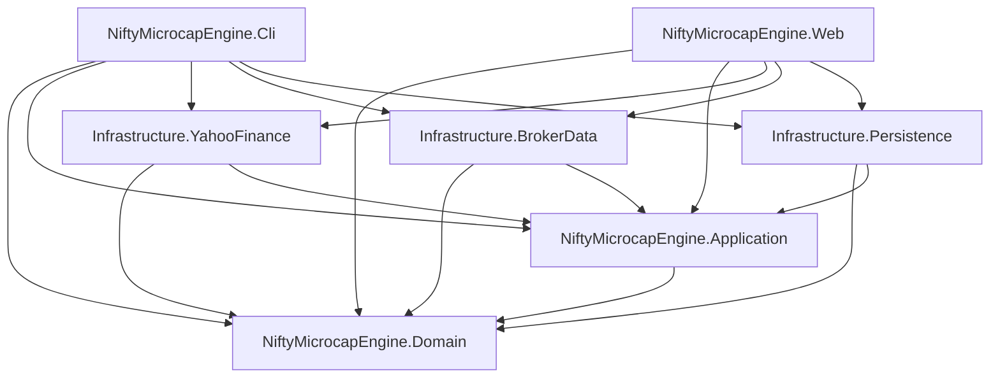
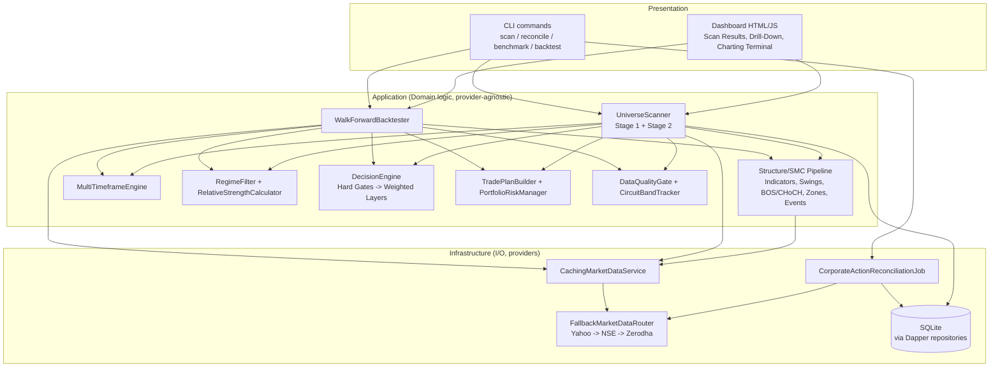
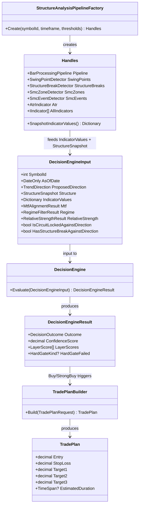
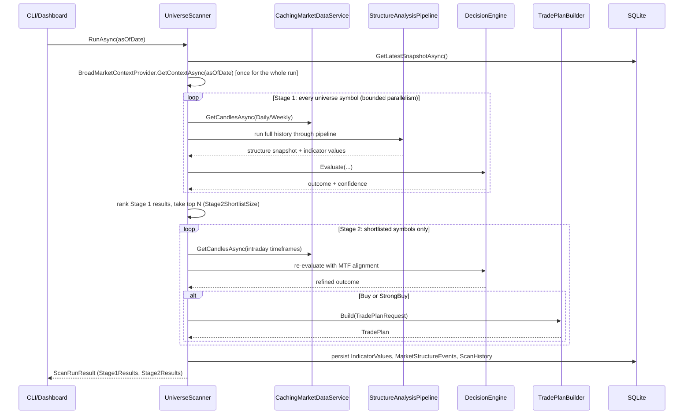
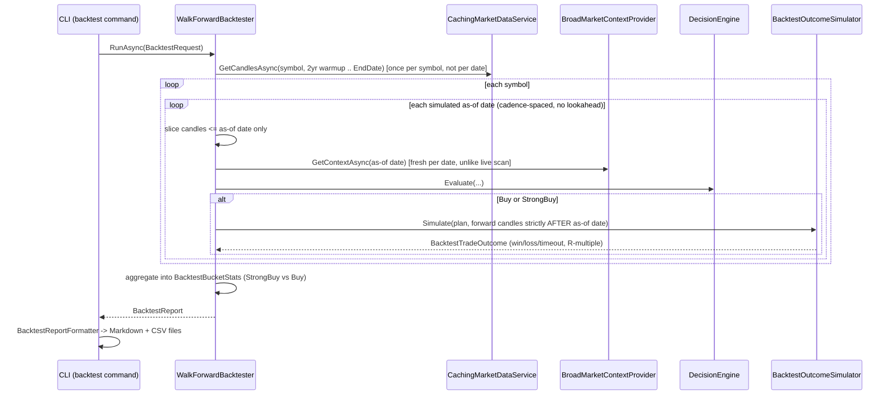

# Architecture, Dependency, Class, and Sequence Diagrams

Companion to README.md — the diagrams deliverable from the checklist. These
are Mermaid diagrams; GitHub, most Markdown viewers, and Claude.ai render
them inline. Kept close to what the code actually does as of this pass —
regenerate/update these if the code moves and they don't, rather than
trusting them as documentation-of-record.

## 1. Project dependency graph

Accurate to the actual `<ProjectReference>` entries in each `.csproj` at the
time of writing — not idealized, the real graph. Domain has no dependencies
(by design — see README's Architecture notes); Application depends only on
Domain; every Infrastructure project and the two hosts (Cli, Web) depend on
Application and Domain but never on each other.

## 2. High-level architecture (layers, not projects)

## 3. Decision pipeline class relationships

What actually feeds the Decision Engine for one symbol/timeframe/as-of-date
— this is the shape both `UniverseScanner.Stage1.cs` and
`WalkForwardBacktester.WalkOneSymbolAsync` build, independently (see the
backtester's own doc comment on why it doesn't share UniverseScanner's
private methods).

## 4. Live scan sequence (`UniverseScanner.RunAsync`)

## 5. Walk-forward backtest sequence

## Honesty note

These diagrams were authored by reading the actual source (constructor
signatures, method call order) rather than from the original spec text, so
they should track what's really implemented — but they haven't been
validated against a running system in this pass, for the same reason
nothing else here has (no .NET SDK or NuGet access in this sandbox). Treat
them as a reviewed-by-inspection map, and correct them the first time they
visibly diverge from the code.
